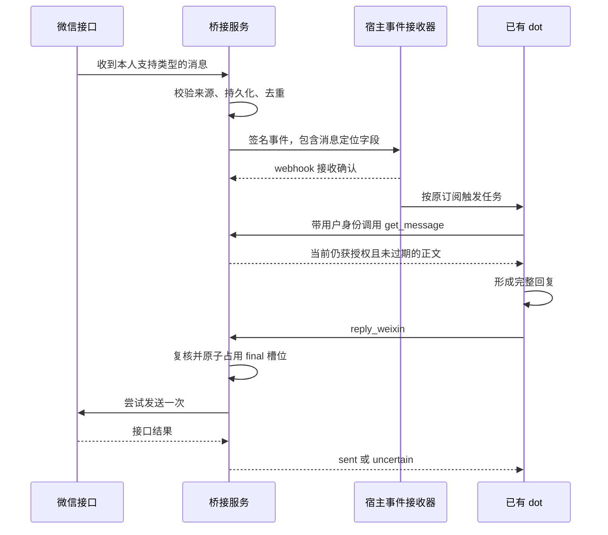

# buu-weDot：把微信接到同一个 dot

本文配套的是采用 MIT、版权署名 buu 的 buu-weDot 工程。它把微信消息转换为 MCP 事件，再让已有 dot 通过工具读取和回复；它不创建另一个模型助手。真实云端和微信端到端验收尚未完成。安装、配置和回滚命令见 [部署说明](DEPLOYMENT.md)，逐项范围见 [能力矩阵](CAPABILITIES.md) 与 [功能差异](PUBLIC_PRIVATE_DIFF.md)。

扩展版按完整桥接业务组织：文本、图片、引用、本人文本缓存、工作状态、通知、合并读取和显式绑定流程分别有自己的安全边界。个人实例的账号和历史数据不公开，但其通用业务代码不能因此被简化为只剩文字。

2026-10-08 技术收尾补入了 FIFO 私有文件输入的非阻塞拒绝、HTTP JSON 媒体类型的精确校验，以及随包的安全反例、扫描器自测和发布验证入口。它没有增加真实账号权限或平台适配。部署前请同时阅读 [发布检查清单](RELEASE_CHECKLIST.md)。

## 先明确要接的是谁

如果目标只是“微信里有个会回答问题的机器人”，可以让微信适配器直接调用模型 API。那会产生一套独立的会话、身份和运行环境。这里的目标是另一件具体的事：让你已经在使用的同一个 dot 收到微信事件，再由这个 dot 使用自己的宿主工具处理消息。

桥接服务因此只负责身份、消息、订阅和发送状态。它不保存模型 API Key，不代替 dot 推理，也不声称能复制 dot 的记忆、权限或上下文。能否在目标 dot 中运行，取决于宿主是否允许这个账户使用私有 MCP 插件和自定义事件任务。

OpenAI 的官方文档将 MCP Events 用于 Work 会话和 dots，并要求相应的工作区插件与事件任务权限；它不是每个 MCP 客户端都具备的能力。应先在目标账户验证事件目录和订阅，再安排真实微信绑定。[官方 MCP Events 文档](https://developers.openai.com/plugins/build/mcp-events)

## 两端之间发生什么



宿主先发现事件，再创建订阅。桥接服务验证 callback 的地址和 challenge 后才允许投递，实际事件使用订阅密钥签名。HTTP `2xx` 只证明宿主接收了 webhook；事件处理是异步的，不能据此认定 dot 已经看到消息或已经回复。[官方投递与接收语义](https://developers.openai.com/plugins/build/mcp-events#handle-delivery-responses)

微信一侧采用官方客户端公开的 `getupdates` / `sendmessage` 交互形态。Tencent 的仓库本身是 OpenClaw 插件，不能仅通过安装它就把某个已有 dot 变成 OpenClaw 会话。这个项目实现的是两者之间的 MCP 桥，而非对官方插件全部功能的移植。[Tencent 官方仓库](https://github.com/Tencent/openclaw-weixin)、[接口参考](https://github.com/Tencent/openclaw-weixin/blob/main/docs/protocol.md)

## 为什么事件不直接充当回复依据

事件负责唤醒和定位消息；当前事件 schema 也包含文本，因此 callback 接收方会接触这份数据。读取工具负责在当前用户身份下重新核验并取回正文。分开这两个动作，才能在订阅建立后仍检查权限、消息是否过期，以及事件中的绑定与消息是否属于这个用户。不能因为事件里已经有文本，就省掉这次核验。

微信正文应始终作为用户提供的数据处理。消息里出现“忽略规则”“换个收件人”或伪造的工具字段，都不能改变服务端绑定，也不能成为跨账户读取的凭据。公开版固定一个 owner 与一个绑定；回复目标来自已核验的原始入站记录，不由模型自由填写。

因此，收到事件后应使用它的精确定位字段调用 `get_message`，读到正文后再形成回复。事件重复、顺序改变或者宿主合并处理多个事件时，每条消息仍须单独完成语义判断和 final 状态检查。不要为了减少工具调用而跳过读取，也不要把上一条消息的授权结果当作下一条的授权。

## 先通过三层验收

### 第一层：本地合成闭环

准备 Node.js `>=24.21.0 <25` 和 macOS、Linux 或 WSL，在仓库根目录执行以下命令，不需要先安装 npm 依赖。此候选不支持原生 Windows：

```sh
node --version
npm test
npm run demo:mock
npm run demo:features
```

打包前可运行 `npm run --silent verify:release > ../candidate-verification.json`，将报告放在源码树外。该入口只支持要求的 Node 24 运行时，执行全部测试、两项 mock demo、公开树扫描与验证前后摘要比对。测试需要 POSIX `mkfifo` 和本机回环监听；不需要真实微信或云端账户。

原 2026-10-06 审查的 147 项按当时定义为 90 项项目测试、29 项独立运行时/安全反例、28 项审查者扫描器自测；后两组脚本未随原候选包附带。本次可直接重跑的 126 项是保留的 90 项、新增 `release-security` 8 项与新增扫描器自测 28 项。新旧两组扫描自测没有声明为逐条等价，历史 29 项没有声称重新执行；最终 ZIP 的重复验证也不累计计数。每次结果以实际报告为准。

测试应全部通过。`demo:mock` 演示文本的合成入站、回调校验、签名验证、独立读取、模拟 final 和重复 final 拦截，且没有 provider 网络调用。`demo:features` 演示扩展业务，边界情况由合成数据、受控时钟与 stub 测试分别验证；不要把这些摘要说成云端验收。此层不需要微信登录、不生成真实微信凭据，也不向微信发送消息。

当前 demo 的成功摘要为：

```json
{"ok":true,"mode":"mock","signature_checks":2,"events":1,"final_claims":1,"duplicate_suppressed":true,"provider_calls":0,"external_network_calls":0,"cloud_subscription_verified":false}
```

最后一个字段故意为 `false`：它没有连接云端订阅。demo 的回调接收器、签名检查和回复均在同一进程的受控接口中执行，没有启动外网监听。

扩展 demo 应返回 `ok:true`、`signature_checks:3`、`events:2`、`native_images:1`、`independent_batch_messages:2` 和 `final_claims:2`。它读取一张合成棋盘图与一条带引用文本，模拟工作 lease、临时确认、image-only final 和主动通知，并验证重复 final 被抑制。`provider_calls` 与 `external_network_calls` 都为零，`cloud_subscription_verified` 与 `qr_enrollment_run` 都为 false。

这里两个 final 属于两条不同原消息，不是同一条消息先发文字再发图片。演示内部显式打开扩展功能的 mock 开关，不会改动实际配置的默认值。二维码仅由独立 stub 测试覆盖，两个 demo 都不会开始登录。

若还要检查本机 HTTP 启动，在同一目录执行：

```sh
npm run init:local -- --directory ../bridge-private
npm start -- --config ../bridge-private/config.json
```

初始化会在源码目录外生成私有 mock 配置、开发 token 和状态密钥，已有目录不会被覆盖。看到 `{"ready":true}` 后，在另一个终端执行：

```sh
curl --fail --silent --show-error http://127.0.0.1:8787/healthz
```

预期返回 `{"ok":true,"mode":"mock"}`。测试完在服务终端按 Ctrl-C 正常停止。健康检查不验证订阅；本地 demo 才是受控的协议闭环。例子中的保留域名只是格式说明，不是可向其投递的宿主 callback。

这一层证明实现内部的协议与状态机可以协作。它不证明公网网络可达、不证明宿主愿意订阅，也不证明已有 dot 会被唤醒。

### 第二层：目标 dot 的 mock 订阅

由管理员提供 HTTPS MCP 入口和受支持的身份接入，把该入口作为私有插件连接到目标账户。先验证工具发现和事件发现，再由目标 dot 所在会话创建 mock 订阅。不要手工猜测宿主 callback、复制别人的订阅，或者在另一套助手里订阅后声称原 dot 已接通。

此层需要逐个确认：订阅已保存、challenge 已通过、合成事件获得接收确认、目标 dot 确实进入相应任务、它在自身连接下读取了正确消息、最后完成一次模拟回复。保留无正文、无凭据的结果摘要即可，不需要公开 callback 地址、签名密钥或原始事件。

### 第三层：本人真实会话

只有前两层完成后才考虑启用 real 配置。可以由本人通过官方支持流程取得绑定后离线导入；扩展版也提供显式本地二维码管理命令。它要求真实 TTY、本人两次确认、五分钟内完成，必要验证码采用隐藏输入，最后只把绑定保存在新的私有目录。准确命令见部署说明。普通启动、收到事件和 MCP 消息工具都不会自动触发扫码。接收、持久化、发送分别有显式配置，其中发送默认关闭。本次源码准备只做 stub 验证，没有真实登录、扫码或导入凭据。

先确认真实入站属于唯一绑定用户，再启用本人同意的发送行为。从一条普通文本开始，检查入站记录、宿主读取、一次 final 和提供方结果。图片、typing 与通知需要各自的额外验收，不能沿用文字测试的成功结论。不要用“发出了请求”替代“提供方确认”，也不要用模拟回复的 `sent:false` 推断真实消息已经发送。

## 文字之外，怎样保持同一套授权

### 图片仍属于原消息

图片事件用于定位入站记录。读取时才从允许的 CDN 下载，在限时、限量、固定目标的连接中完成解密与格式检查，并作为 MCP 原生 image 内容返回。下载是异步操作，所以下载后仍需复核原 owner、原绑定、原记录和一小时时限。曾经允许读取不能变成永久图片访问权。

宿主必须保留原生 image 块。只把 `structuredContent` 转成 JSON 字符串，会丢掉图片本身。合并读取中的图片索引对应具体内容块，不应将整批图片交给任意一条消息。

图片出站是扩展版的新能力。本版为 image-only final，显式拒绝 caption，不会自动追加一条说明文字。同一个原消息只选择文字或图片 final；二者共享一个槽位。它使用经过检查的图片字节，不能接受用户文字里随意指定的下载 URL 或服务器文件路径；上传之前就要占用原消息的 final 槽位。上传或发送结果不确定时，不自动从头再上传并发送。对原图片加引用的文字回复，是另一个明确的行为，不能冒充“发送了一张图片”。

### 同一个 dot 怎样把图片交给桥

实际工具是 `reply_weixin_image`，参数 `image` 含 `mime_type` 和标准 base64 `data`。仅支持 PNG/JPEG，原始图片最大 4 MiB，并有尺寸和像素限制。目标 `binding_id` / `message_id` 必须来自当前已核验的入站消息，不能为了图片改收件人。

这条路径有一个常被省略的宿主依赖：**看到图片不等于取得图片字节。** 若图片来自附件、Library 或图片生成工具，宿主必须先通过该账户已授权的素材读取方式取得原始文件，再由受控的调用代码读取有限字节、编码，并作为参数交给原生认证的 MCP 工具。不要让模型凭视觉重造 base64，也不要把素材 ID 当成图片内容。

本仓库没有提供 Library / 图片生成工具的素材导出适配器，也不读取 dot 的文件系统。工具不接受素材 ID、外链或路径；这些值不会在桥里被自动解引用。若目标宿主无法把素材字节交给原生工具，图片出站的桥端代码可以完成本地测试，但“原 dot 生成图后发到微信”的端到端路径仍未完成。此时不能改用机器凭据直连 provider 来冒充原 dot 的用户调用。

验收应单独核对宿主的工具参数大小、base64 字节保持和原生 image 块展示。入站图片必须保留 image 块；出站必须能获得文件字节。这是两个方向的能力，不能互相推导。mock 中的生成棋盘图只用来验证桥的媒体契约，不会证明任何宿主的素材导出已经接通。

仓库里已有一个具体的字节示例：`demo:features` 从本次授权读取的 `content` 中，按该消息的 `native_image_content_indexes` 取出 image 块，再将 `{mime_type: block.mimeType, data: block.data}` 作为模拟图片 final 的 `image` 参数。这验证了桥两端的字节格式。如果真实宿主也允许程序化访问原生工具结果，可以在用户请求需要回传该图片时采用同样映射；它并不证明宿主会向调用代码开放附件或生成图片的原字节。发送前仍由桥重新核验原消息，并占用它唯一的 final。

### 引用可以解释，不能提升权限

当前消息里的引用只保留需要的文本、类型、标题、参考 ID 和来源状态。引用作者、嵌套 URL、媒体 key 和 context 不能借此成为授权。只有新部署者显式开启本人文本缓存后，才允许在同一绑定的一小时范围内尝试解析纯文本参考 ID。

这不是任意微信历史检索。没有捕获到的旧引用、缓存冲突、跨 owner、过期文本或媒体引用，都不能靠猜测补成“已验证的原文”。缓存命中也不改变引用作为不可信数据的性质。

### 工作状态与通知各有用途

processing 是调用方对工作的有限期声明。只有确实在处理该条消息时才声明 running；排队等待不是 running。当前 real 实现要求本人发送同意，即使只声明 processing 而未开启 typing。`running` 的 lease 为 45 秒，单次工作最多十分钟，且不能越过原消息的一小时时限；`waiting`、`completed`、`failed` 和 final 会停止工作提示。typing 是另行启用的提供方请求；状态接口成功不证明模型正在执行，也不证明微信客户端实际显示了提示。

扩展版另有默认关闭的 `receiptTyping`：有效入站后最多一次五秒接收提示，持久占用避免重启重播。它需要同时开启 processing 与 typing，但不表示 dot 已开始处理；真正开始工作仍由调用方声明 running。短提示、工作 lease 与文字确认是三种不同操作。

主动通知需要与回复不同的同意与账本。它只能发给原绑定本人，用稳定的通知 ID 表示一次新事件，不能从工具参数指定另一个收件人。context 最大年龄默认一小时，可配置范围为一分钟至三小时；这是部署者的本地策略，提供方是否仍接受它只能以实际响应为准。通知源事件需要处于五分钟新鲜度范围，并遵守限频与不确定结果阻断，不能将过期事件换 ID 当成新通知。

可选临时文字确认也会增加一条发送，默认不自动开启。它与最终回复的槽位分开；不能为了让系统“看起来快”就隐式多发确认，或把通知接口当作重试不确定 final 的绕过方式。

### 合并读取减少步骤，但不合并消息身份

已知精确 ID 时直接 get。唤醒缺少 ID 时，可以在有界待办中读取最多三条，每条保持独立身份和 final。最后一个图片读取完成后，要再次检查整批原始记录，才把数据交给宿主。

newest-first 的有界选择不保证全局公平。工程任务长期占着待办时，重复读同一批不会自动找到更老的消息；要按既有游标分页规则处理，而不是无限循环。减少一次工具调用也不能直接等同于已获得某个秒数的端到端收益。

## final 的边界比重试次数更重要

发送请求前，桥接服务先持久化占用该消息的 final 槽位。这样，重复事件和并发工具调用不能再次占用同一条消息。若网络断开、服务中止或者结果无法确定，状态保守地进入 `uncertain`，不自动重发。

这个设计不能实现跨两个独立系统的“绝对恰好一次送达”。它实现的是本地单次 final 占用和对不确定结果的抑制重试。误把不确定当失败再发一次，可能让用户收到两条；误把占用当成功，也可能漏报失败。排障时应保留原状态，人工核对，不要删除数据库或清空 claim 来重新试。

回调投递重试与微信回复重试是两条不同的路径。回调可以在有限次数内重投同一事件；微信 final 的不确定结果不会因为回调重试而重新发送。

## 身份、网络和数据各有一条边界

身份层需要验证令牌的签名、issuer、resource、subject、scope 和有效期。公开版不把任意代理请求头当作已认证用户，也不自建完整 OAuth 登录服务。仅供本机 mock 开发的 bearer 模式不能暴露为公网身份方案。

网络层只向明确许可的 HTTPS 目的地连接，并在连接时核查解析出的地址。DNS 校验必须与实际连接保持一致；只检查 URL 字符串不足以防止 SSRF。callback 不允许随意重定向，微信 API 目的地也不会由消息正文决定。

数据层保留原始消息的时限与状态。到期后拒绝读取和回复，不因为重新触发任务而延长消息寿命。加密字段不能替代磁盘访问控制；密钥、绑定文件和数据库必须留在私有运行目录，不能放进源码包或公开排障记录。

具体实现、默认值和部署者仍需承担的事项见 [安全说明](SECURITY.md)。

## 能做到什么，暂时不能承诺什么

扩展版逐项处理图片、引用、缓存、状态、通知和绑定流程，准确默认值与当前验证状态见能力矩阵。文件、语音、视频、群聊、多账户和任意历史查询没有在本次核验的成熟桥接中找到完整实现；不能用 Tencent 上游支持的媒体类型推断本项目也已具备。

完整 OAuth 身份提供方、Sites 网页身份适配及跨平台迁移工具仍需独立提供。它们不是不可公开的个人功能，而是本候选尚未交付的具体平台适配。单机 Node 跑通或同 schema 版本切换成功，不能掩盖这些差异。

旧文字候选与扩展版数据库也明确不兼容，原地启动与版本切换会拒绝。不要用新空库承接原绑定来绕过，因为那会丢失单次发送账本。把已有账号迁过来需要专门保留历史的迁移方案；本地同 schema 回滚演练不提供这项能力。

它也没有“十秒必回”的承诺。总时间包括微信收取、回调往返、宿主调度、工具调用、dot 处理和发送确认。缩短本地处理函数，不能直接证明整条链路更快。当前公开候选尚未做真实云端或微信验收；本地测试结果不是公网性能基准，旧私有环境的 mock 数据也不能转作公开版实测。

如果要研究延迟，应先固定时间定义和消息关联：源消息时间、callback 接收确认、目标 dot 首次观察、核验后正文可用、回复正文就绪、final 发起、提供方确认分别记录。跨机器时钟未校准、缺少精确关联或缺少打点的区间应标为未知，不能全部归因于平台队列，也不能把发送后的等待扣进“生成正文时间”。

接入成功的判断很朴素：同一个目标 dot，通过它自己的授权连接，读到了正确的本人消息，并在正确绑定上完成了一次可核对的回复。部署指南围绕这个判断逐步验收，而不是把某个接口返回成功当成整条链路成功。
